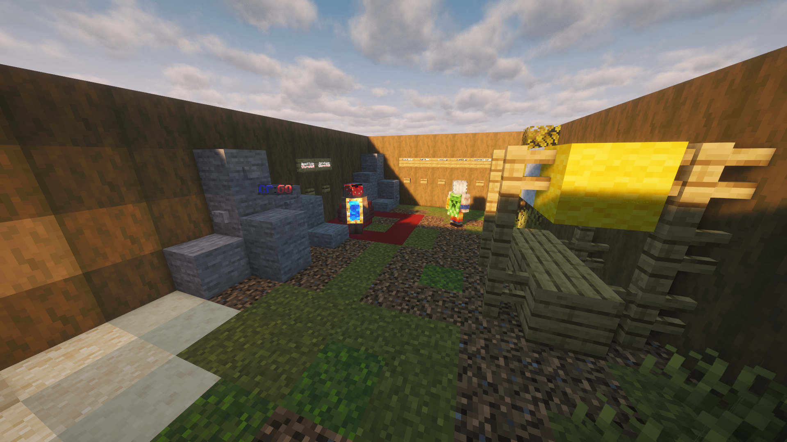
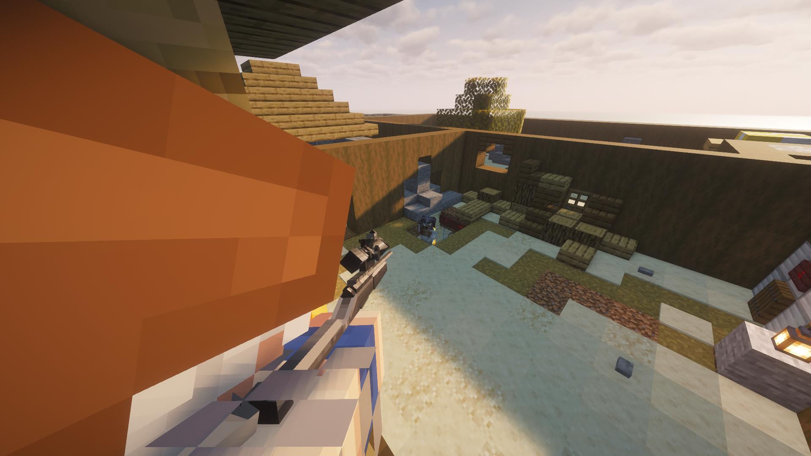
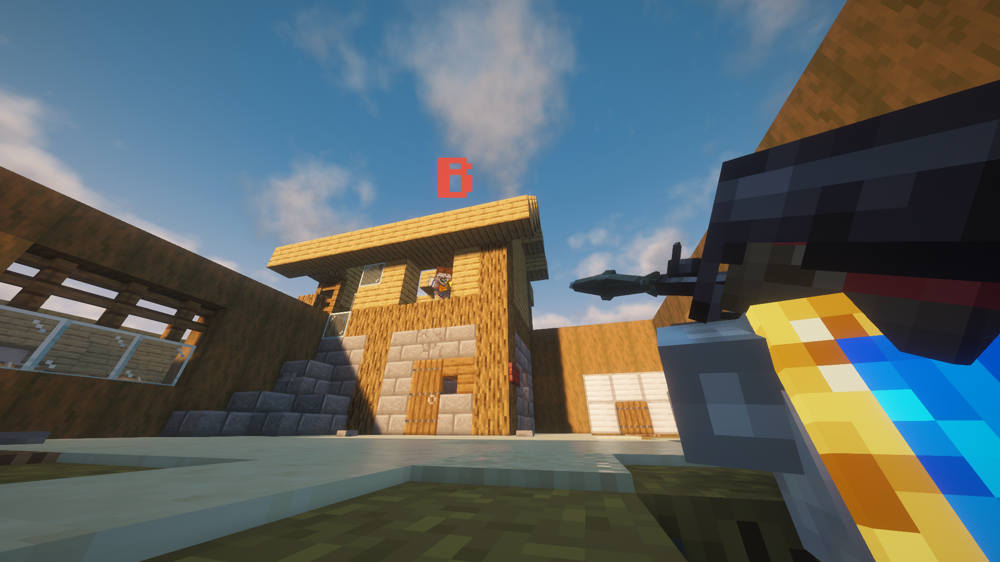
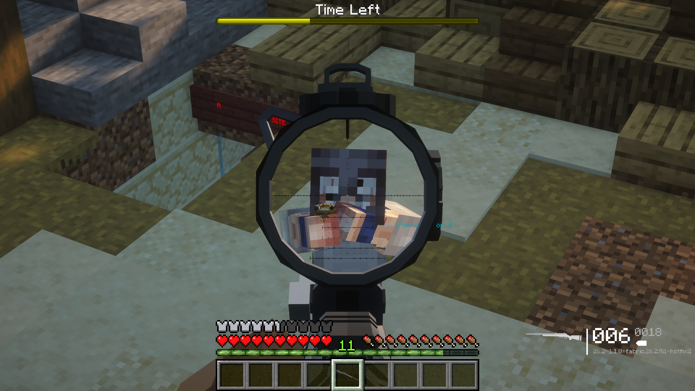
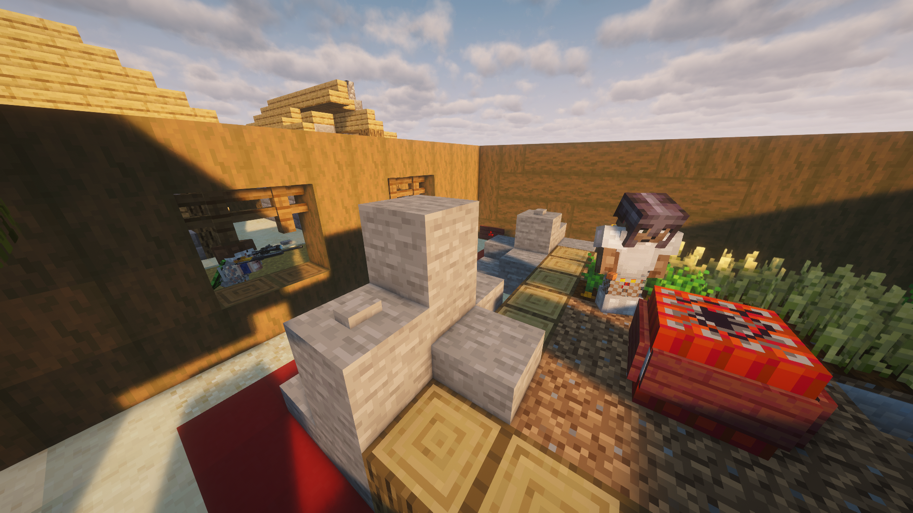
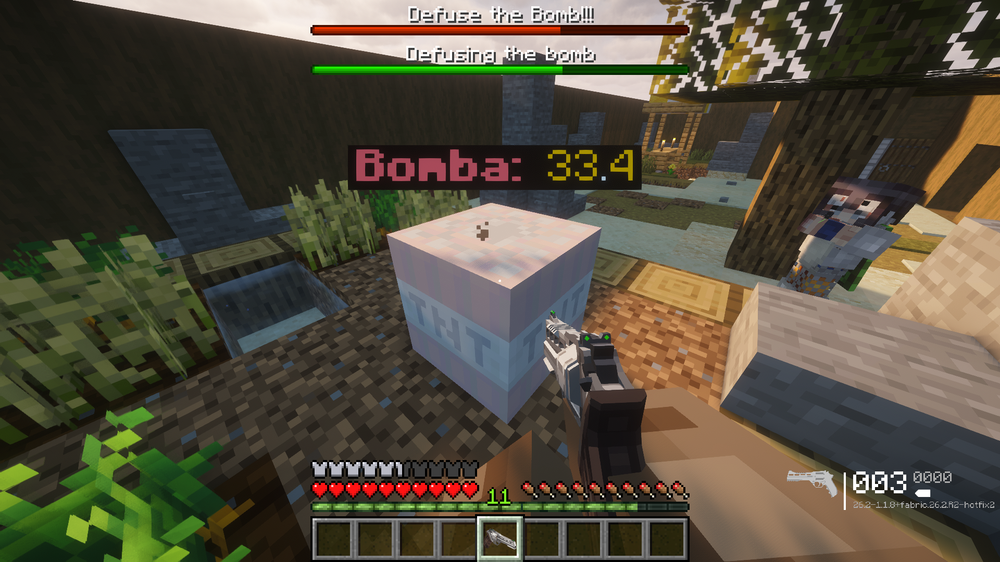

# Counter Presence: Global Offensive

A **Counter-Strike: Global Offensive inspired game mode recreated in Minecraft**, using command blocks and Fabric mods.

This repository only includes the **game map**. To play **CP:GO**, you will also need to download and install the required mods listed below.

**Version:** `v0.1.0-beta`

⚠ This is an early testing version and many features are still being developed, changed, or improved.

The project is publicly available, but you may encounter bugs, unfinished features, balancing issues, or other problems.

---

## Screenshots

  

  
  

  
  

  
  

---

## About the Project

The goal of this project is to recreate the classic **CS:GO-style gameplay experience inside Minecraft**.

The game uses **command blocks** to handle most of the gameplay systems, while Fabric mods provide additional features such as weapons.

Some of the planned and existing features include:

* 🔫 Weapon system
* 💣 Bomb system
* ⏱️ Round countdown
* 👥 Team-based gameplay
* 🏆 Round objectives
* 🗺️ Custom map
* ⚙️ Command block systems
* 🔧 More features currently under development

---

## Required Mods

### Required

* [**[UNOFFICIAL] TaCZ Refabricated**](https://www.curseforge.com/minecraft/mc-mods/unofficial-tacz-refabricated) — Required for the weapon system.
* [**Guns++**]() — Required for the weapon system.
* [**Essential Mod**](https://www.curseforge.com/minecraft/mc-mods/essential-mod) — Required to play with other players.

### Required Dependencies

* [**Forge Config API Port**](https://www.curseforge.com/minecraft/mc-mods/forge-config-api-port)
* [**Collective**](https://www.curseforge.com/minecraft/mc-mods/collective)
* [**Framework**](https://www.curseforge.com/minecraft/mc-mods/framework)
* [**Lithium** ](https://www.curseforge.com/minecraft/mc-mods/lithium)

### Optional

* **Just Enough Items (JEI)** — Not required to play. Recommended for easier access to item information and recipes.
* **Not Enough Animations** — Not required to play. Recommended for better animations.
* **WorldEdit** — Not required to play. Recommended for easier map editing.
* **Compact Help Command** — Not required to play. Recommended for easier access to commands.

---

## Requirements

* **Minecraft:** `26.2`
* **Mod Loader:** Fabric
* **Fabric Loader:** `0.158.0+26.2`

Make sure you use the correct Minecraft and Fabric versions required by the project.

---

## Installation

### CurseForge

The recommended way to install the project is through the **CurseForge modpack**, which will include the required mods.

**Not available yet.**

### Manual Installation

If you are not using CurseForge:

1. Install the required Minecraft version.
2. Install **Fabric Loader**.
3. Download the required mods.
4. Place the `.jar` files inside your Minecraft `mods` folder.
5. Download and install the CS:GO in Minecraft world.
6. Open the world using the Fabric profile.
7. Enjoy!

---
## License

This project is published under the **MIT License**.

---

## Credits

Created by **fustcoma & SoyOwen**.

Inspired by **Counter-Strike: Global Offensive**.

This is a fan-made Minecraft project and is **not affiliated with or endorsed by Valve or Counter-Strike**.
